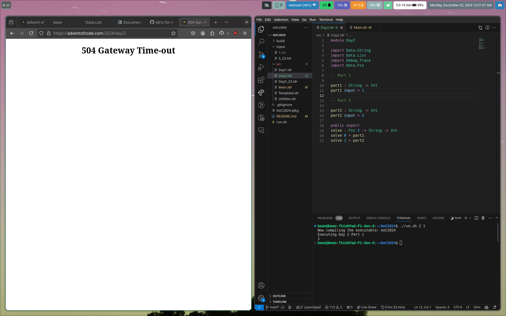

# Advent of Code 2024

In Idris 2!

### Day 1
**Part 1: #4177 in 00:09:50, runtime: 551us**

I opened the input and sighed with relief when I saw it; I haven't found a regex library for Idris2 yet, so this:
```
3   4
4   3
2   5
1   3
3   9
3   3
```
was a nice gentle start. I could just use `words` :)

Then I realized I'd need to zip? unzip? (it's unzip) those lists so I could sort them. I tried to be fancy and use a `Vect 2 Int`, but after wasting a bit of time, I just went with a `(Int, Int)` since that's what `unzip` uses. So I unzipped them to get a `(List Int, List Int)`, then sorted those lists, then rezipped them and took the difference between every pair and added them up with `sum` (I like functional programming :))

**Part 2: #3827 in 00:13:35, runtime: 10.571ms**

So we have to do something with counting the number of occurrences of an element in a list. I had a vague theory that I could use a `Set` or `HashMap` where all entries being added have `1` for the value or something but didn't know how to make one in Idris yet, so I just did this instead:
```
count : (Eq a) => List a -> a -> Int
count (x :: xs) el = (if x == el then 1 else 0) + count xs el
count [] _ = 0
```
(edit: after discussion, `count xs el = sum (map (\el => if x == el then 1 else 0) xs)` is a LOT nicer)

I forgot the `el` in `count b el` here `map (\el => (el * count b el)) a` which was confusing me (it was throwing a type error), but then I realized (I had went from `map (count b) a` to the above statement and forgot to change it :/)

Anyway, not too much that was exciting today, but functional programming is always nice!

### Day 2
**Part 1: #4301 in 00:13:17, runtime: 1.054ms**

I GOT A GATEWAY TIMEOUT AND A LATE START :sad:



So after that amazing start, I immediately* figured out the first condition (ascending or descending order): just check if the sorted list is equal to the original list.

For the differences part, I wondered if there was a standard way to group values together (2 at a time), but couldn't find one quickly so wrote a function myself.

I subsequently spent approximately 5 minutes trying to get the minimum/maximum of that differences list to verify that the minimum >= 1 and the maximum <= 3. The only minimum/maximum was in `Data.Nat`? So I converted from `Int` to `Nat` but it still didn't typecheck? I was confused, couldn't figure it out, then realized I could just sort and take the head and last elements.

But then I had to convince Idris the list was non-empty to get the head and last, and I initially chose the wrong list to prove...anyway I figured it out, was feeling good, YOLOed it, and got it...wrong?

I checked it against the sample, and it was in fact not identifying a valid list. ...because...if the list is decreasing...then it'll be equal to the reverse of the sorted list...

After that fix, it worked on the sample and on the real input.

**Part 2: #2530 in 00:18:46, runtime: 3.542ms**
Not too bad, just some old fashioned brute force. The thing that tripped me up the most was I initially summed up ones for *all* lists with one element removed, but it should only be 1 if one of them is valid and 0 otherwise. After that fix, it worked :)

### Day 3

**Part 1: #1939 in 00:05:48**
Python, regex in VS Code, because I thought I could do it fast but really couldn't

`mul\(\d+,\d+\)`

Solved it decently quickly, then

**Part 2: #7331 in 00:37:00, runtime: 168us**
could you tell I switched languages? :)

worked on Idris parsing which took much longer and I'm still cleaning it up, initially read numbers backwards because `(newChar :: existingNumString)` is not `(existingNumString ++ [newChar])` ...oops

TODO use https://github.com/kasiaMarek/TyRE maybe, idk

But in this silly journey we fell down a dependent typing rabbit hole trying to constrain my `Instruction` type to only be numeric, which probably would have happened anyway

I need sleep but this is really interesting

also it might snow but it's not snowing which makes us snow sad (even checked 4W alcove window)